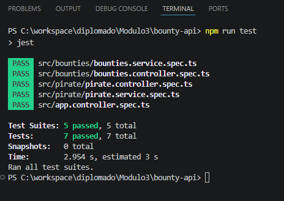

# Bounty API - Sistema de Recompensas de la Marina

## Descripción

API desarrollada con NestJS para gestionar piratas y sus recompensas (bounties).
Permite crear, consultar, actualizar y eliminar registros, aplicando arquitectura modular, validación de datos y testing.

---

## Tecnologías utilizadas

* NestJS.
* MongoDB + Mongoose.
* TypeScript.
* Jest (Unit Testing).
* class-validator / class-transformer.

---

## Estructura del proyecto

* `pirate/` → gestión de piratas.
* `bounties/` → gestión de recompensas.
* `database/` → conexión a MongoDB.

---

## Instalación

1. Clonar repositorio:
  - Ir a la siguiente URL de Github https://github.com/LuisSipps/Modulo3-Bounty-API.git
  - Presionar el boton verde <> **code** y apretamos **Download ZIP**.
  - Extraemos el archivo ZIP y lo abrimos en **Visual Studio Code**.

2. Instalar dependencias:
    - Abrimos una terminal (CMD) como administrador y navegamos hasta nuestro proyecto.
    - Ahora ejecutar:
      npm install

3. Crear archivo .env en Visual Studio Code:
    Crear un archivo llamado `.env` en la raíz del proyecto con el siguiente contenido:

  PORT=3000

  MONGODB_URI=tu_uri_de_mongodb

  JWT_SECRET=tu_clave_secreta

4. Importar colección de Postman:
    - Ahora abriremos Postman y en la parte superior izquierda encontraremos tres puntos.
    - Apretamos **Importar** o **Import**.
    - Finalmente arrastramos o seleccionamos el archivo Bounty-API.postaman_collection.json que se encuentra en este proyecto.

5.  Ejecución:
    En el CMD o en una terminal de Visual Studio Code ejecutaremos nuestro código con:

    npm run start:dev

## Endpoints principales

### Pirates

* POST http://localhost:3000/pirates
* GET http://localhost:3000/pirates
* GET http://localhost:3000/pirates/id-pirata
* PATCH http://localhost:3000/pirates/id-pirata
* DELETE http://localhost:3000/pirates/id-pirata

---

### Bounties

* POST http://localhost:3000/bounties
* GET http://localhost:3000/bounties
* GET http://localhost:3000/bounties/id-bounty
* PATCH http://localhost:3000/bounties/id-bounty
* DELETE http://localhost:3000/bounties/id-bounty
* GET http://localhost:3000/bounties/active

---

6. Testing:
    Para ver las pruebas unitarias es necesario ejecutar lo siguiente en la terminal:

    npm run test

---

## Autor

Luis Sepúlveda Villarroel
